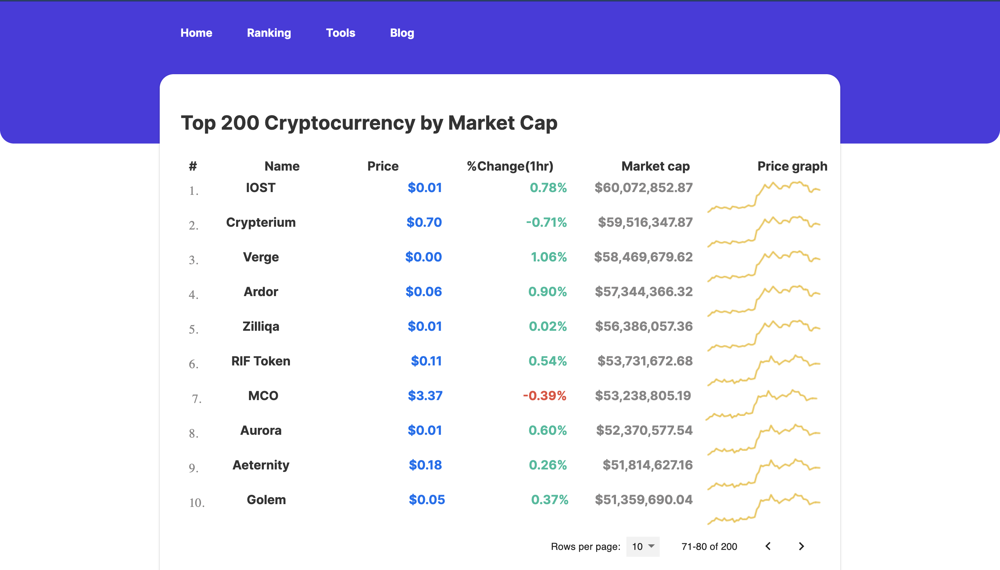

## Cryptocurrency List
This project show a list of all cryptocurrencies and there current value in the market.
#### Live URL
[a link](https://brave-heyrovsky-2c7443.netlify.com/)

#### Run project locally 
To run the project on you local machine 
 - first  run 
    - `` git pull https://github.com/Bensigo/crypto-list.git`` 
 - install dependecies
    - ``npm instal or yarn install``
 - start server
   - ``yarn start`` or ``npm run start``

#### Run Test ``yarn  test`` or ``npm  test``

#### Technology used
  - React
  - Redux and Redux-saga (state management)
  - jest (unit testing)
  - CircleCI ( continuous integration)
  - typescript

#### App look

